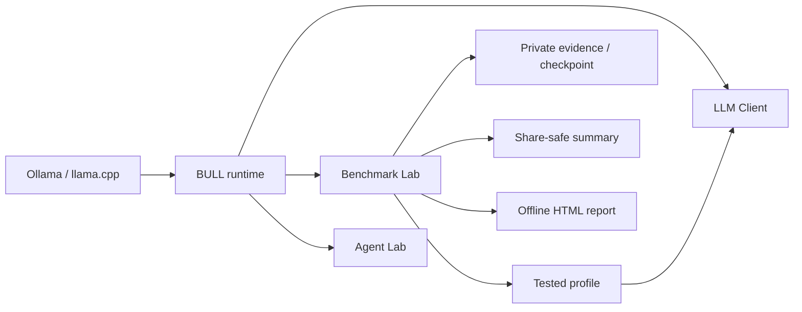

<p align="center">
  
</p>

<p align="center">
  <strong>Benchmarking &amp; Usage of Local Language Models</strong><br>
  Reproducible local-model evaluation on the hardware you actually use.
</p>

<p align="center">
  <a href="README.md"><strong>English</strong></a> ·
  <a href="README_RU.md"><strong>Русский</strong></a>
</p>

<p align="center">
  <a href="https://github.com/MrChronon/bull/releases/tag/v0.29.0.1"></a>
  <a href="LICENSE"></a>
  <a href="https://github.com/MrChronon/bull/releases"></a>
  
</p>

<p align="center">
  <a href="https://github.com/MrChronon/bull/releases/tag/v0.29.0.1"><strong>BULL v0.29.0.1 release and downloads</strong></a><br><br>
  <a href="#quick-start">Quick start</a> ·
  <a href="Docs/en/USER_GUIDE.md">User guide</a> ·
  <a href="Docs/ru/USER_GUIDE.md">Руководство</a> ·
  <a href="Docs/en/BENCHMARKS.md">Build a benchmark</a> ·
  <a href="https://github.com/MrChronon/bull/discussions">Discuss methodology</a> ·
  <a href="CONTRIBUTING.md">Contribute</a>
</p>

---

**Latest stable release: v0.29.0.1 — Pack Library.**
[Download the Windows bundle](https://github.com/MrChronon/bull/releases/download/v0.29.0.1/BULL-v0.29.0.1-Bundle.zip) ·
[SHA-256 checksum](https://github.com/MrChronon/bull/releases/download/v0.29.0.1/BULL-v0.29.0.1-Bundle.sha256.txt).
Extract into a new folder and start **Setup.exe**. The release and “latest” badge
now point to v0.29.0.1. See [verified coverage and known validation limits](Docs/RELEASE_READINESS.md).

> **BULL is not a hosted leaderboard.** It is an open, portable benchmark lab for
> inspecting local model quality, stability, speed, recovery and runtime behavior
> without sending prompts or model output to a cloud service.

BULL — Benchmark Lab is a Windows-first client and reproducible evaluation
platform for local language models served by **Ollama** or a compatible **llama.cpp HTTP
server**. Run chat, compare selected models, resume interrupted suites, inspect
offline reports and move a tested profile into the working client.

<p align="center">
  
</p>

## Why BULL

**v0.29 Pack Library:** install independent ZIP packs, keep them across application
updates, compare all or selected tasks, and create your own versioned pack in
[Author Workshop](Docs/en/AUTHOR_WORKSHOP.md). Setup offers base tests,
your ZIP or skip. No particular pack is mandatory. See the
[library guide](Docs/en/PACK_LIBRARY_GUIDE.md) and
[cloud LLM author instructions](Docs/en/PACK_AUTHOR_LLM.md).

| Evaluation problem | How BULL handles it |
| --- | --- |
| Client recovery can hide weak native output | Reports **native model quality** and **final system quality** separately |
| One average hides unstable seeds | Shows mean, sample SD, min/max, worst seed and rank stability |
| Model/test order can distort speed | Uses job-level counterbalanced scheduling for new runs |
| Cold load and warm generation get mixed | Classifies warm measurements from observed load duration |
| A disconnect can invalidate hours of work | Atomically checkpoints completed runs and resumes only unfinished work |
| Benchmark changes are hard to audit | Uses versioned, hash-checked, data-only benchmark packs |
| Private endpoints leak into shared results | Excludes connections, keys, logs, chats and runtime state from public releases |
| Generic tests miss a user's actual job | Loads prompt-only `.txt` or deterministic `.yaml` tasks from `UserTests` |
| A table does not answer “which model fits me?” | Shows transparent Quality, Speed, Balance and Low-memory choices plus custom weights |

## What you can measure

- **CHAT quality:** instruction following, groundedness, dialogue state,
  causality, semantic negation, Russian business language and reasoning;
- **RU Dialogue candidate:** 10 parameterized Russian cases with separately
  reported semantic and structural scores plus auditable critical failures;
- **contract completion:** generation, structure, terminal JSON and exact schema
  are tracked as distinct facts;
- **performance:** load duration, warm tokens/second and CPU/RAM/GPU/VRAM on the
  inference host; unavailable counters show `N/A`, not zero;
- **language tracks:** separate Russian and English suites plus paired bilingual
  execution of the same semantic tasks;
- **stability:** multi-seed dispersion, worst cases, uncertainty-aware Pareto
  status and category-level comparisons;
- **system behavior:** recovery use, retries, fingerprints, resume provenance and
  tested-profile export;
- **agent behavior:** a restricted Agent Lab MVP with independent verification.

For general test packs, BULL shows measured top-three places directly in the terminal for
Native quality, warm speed, observed VRAM and balance. These ranks remain
separate from quality/task-gated recommendations. The self-contained HTML report
adds numeric quality/speed and task/time charts, resource views, a test heatmap,
parameter provenance and plain-language test descriptions. Nothing becomes a new
benchmark score or universal ranking.
Language comparisons instead use a dedicated RU/EN view with language compliance,
script purity, separate native timing and matched-pair differences. Six language
tasks do not establish general linguistic competence; see [reading results](Docs/en/RESULTS.md).

For your own work, copy a template into [`UserTests`](UserTests). A `.txt` file
runs the same prompt across selected models without fabricating quality. A
structured `.yaml` file can declare bounded deterministic checks. See the
[user-test authoring guide](Docs/en/BENCHMARKS.md).

The bundled `bull_chat_core@1.0.0` pack contains the stable 12-case CHAT Core.
`bull_language_comparison` adds Russian, English and paired bilingual tracks so
language quality and throughput are not collapsed into one average.
The new `bull_ru_dialogue@1.0.0` candidate adds 10 public parameterized cases for
confirmed-state updates, evidence limits, causal caution, instruction retention,
business Russian and embedded-instruction resistance. Its scorer publishes
semantic and structural dimensions independently. Automatic scores support
investigation; they do not replace expert review or establish general model
superiority from a single run.

## Quick start

### Requirements

- Windows 11;
- Python 3.10+ and PowerShell;
- for chat or new inference: Ollama or a compatible llama.cpp HTTP server and
  at least one model installed in the selected backend.

Setup can offer Python installation and a private verification environment with
explicit confirmation. Models are installed separately. Native launchers are
unsigned; review the checksum and source before running them.

### Install

1. Obtain `BULL-v0.29.0.1-Bundle.zip` and `BULL-v0.29.0.1-Bundle.sha256.txt`.
   After publication, both are attached to the [matching release](https://github.com/MrChronon/bull/releases/tag/v0.29.0.1).
   GitHub's automatic “Source code” archive is not the verified install bundle.
2. Verify the checksum, extract the archive and run
   `Setup.exe` (branded install-arrow icon; `Setup.cmd` fallback).
3. Choose English or Russian, then **BULL Red** or **BULL Matrix**. Install standard packs, import a ZIP by HTTPS
   link or local path, or skip tests.
4. Wait for the full internal regression, then configure an existing LLM
   connection or leave it for later.
5. Choose Launch BULL or Exit installer. Open **Model testing → Compare a test
   pack** to choose tasks, models and run settings.

Home has five primary sections: Model testing, Chat with a model, Test settings,
Connection settings and Program settings. Section 6, Additional, provides
session status, diagnostics, help and Agent Benchmark without another
submenu. Every launch reruns the essential
18 integrity checks. Home shows integrity and connection only; pack readiness
and read-only pack → task browsing appear in the two testing sections. Missing setup is
shown as a warning; settings and saved reports remain available.
Before installation the root contains only `Setup.exe`; `BULL.exe` is created
after successful full verification and connection setup/skip.
Normal startup uses `BULL.exe` or its installed shortcut. Theme changes update
owned shortcut icons. Only BULL Red and BULL Matrix are offered.

The interface opens without a running backend, so connection setup, help,
diagnostics and saved reports remain available offline.

Checksum verification, safe upgrades and removal are in the
[installation guide](Docs/en/INSTALLATION.md). Do not copy an old configured
bundle over the new one: packs persist separately, while chats, results and
connections require a deliberate private backup.

## Local and remote



- **Local:** client and models run on one Windows computer.
- **Remote:** BULL reaches a separately administered Windows node through a
  pinned SSH tunnel.
The installer configures only the BULL client, not an LLM server.

If `ssh bull-home` already works with your key, choose
**Connection settings → New server from SSH alias** and enter `bull-home`. See the
[connection guide](Docs/en/CONNECTIONS.md). Never expose Ollama `11434` or
llama.cpp `8080` directly to the Internet.

## Reproducible outputs

Each benchmark can produce raw JSON/CSV, an immutable private evidence record, a
privacy-audited share-safe summary, an atomic checkpoint, tested profiles and a
self-contained HTML report. Provenance includes prompt/pack/scorer/verifier hashes
and separate launch/effective runtime fingerprints. Reports keep native model
output, client assistance and recovery behavior in distinct metric spaces.

```powershell
.\Run-Tests.ps1
.\Test-Public-Release.ps1 -AuditReleaseCandidatesOnly
.\Build-Release.ps1
```

The current release suite contains **668 offline regressions**. Release gates
also cover clean Python without site packages, forced `cp1251`, startup
integration, manifest hashes and ZIP verification.

## Help shape the benchmark

The project is looking for rigorous criticism from local-model users, benchmark
authors, inference engineers and hardware experimenters.

- Use [Discussions](https://github.com/MrChronon/bull/discussions) for benchmark
  design, scorer trade-offs, taxonomy, hardware methodology and open-ended ideas.
- Open a [benchmark feedback issue](https://github.com/MrChronon/bull/issues/new/choose)
  for a concrete false positive, false negative or reproducibility problem.
- Open a bug report only when behavior is reproducible; sanitize endpoints,
  usernames, paths, prompts and model responses before attaching evidence.
- Read [CONTRIBUTING.md](CONTRIBUTING.md) before changing prompts, scorers,
  schemas, runtime or benchmark packs.

English and Russian are both welcome. Small, test-backed pull requests are
preferred. The current architecture and transition plan live in
[Docs/BULL_TARGET_ARCHITECTURE.md](Docs/BULL_TARGET_ARCHITECTURE.md) and
[Docs/BULL_TRANSITION_ROADMAP.md](Docs/BULL_TRANSITION_ROADMAP.md).

## Security and privacy

Language models are not bundled. Generated-code execution is not an OS sandbox;
use a disposable VM without secrets or network access for untrusted output.
Public release gates exclude `Chats`, `Runtime`, `Benchmarks`, `Exports`,
`Workspace`, keys, endpoints and local logs. Read the
[security model](Docs/en/SECURITY.md) before exposing any server role.

## Project status

`v0.29.0.1` is **Pack Library**: an optional persistent ZIP library, one exact
pack per run, editable author sources and complete private snapshots for resume
after pack updates or removal. It retains terminal/HTML comparisons and available
CPU/RAM/GPU/VRAM telemetry. Prompts/references are preserved; the language pack
1.0.1/scorer v2 correction is independently versioned and historical v1 results
stay unchanged. Specialized RU/EN reporting does not assign a combined winner.
The release passes 668 offline checks; terminal, exit and live inference acceptance
remain separate. Linux is planned, not supported yet. Additional contains diagnostics,
help and Agent Benchmark; GPU Lab is removed. See the
[release notes](Docs/en/RELEASE_NOTES.md) and
[documentation index](Docs/README.md).
The [roadmap](Docs/BULL_TRANSITION_ROADMAP.md) separates completed features,
open acceptance and future pack-report/language work. v0.29.0.1 is the
owner-designated stable release; remaining manual checks are documented separately.
Stable promotion changes release metadata and current documentation only. The
installation ZIP, checksum and tag remain the original hash-verified snapshot;
its bundled documents retain the initial pre-release wording. Documentation on
`main` reflects the later stable designation. No application or pack bytes changed.

## Repository guide

- [English documentation](Docs/en/README.md) · [Русская документация](Docs/ru/README.md)
- [Changelog](CHANGELOG.md) · [English roadmap](Docs/en/ROADMAP.md) · [Русский roadmap](Docs/ru/ROADMAP.md)
- [Contributing](CONTRIBUTING.md) · [Support](SUPPORT.md) · [Community rules](CODE_OF_CONDUCT.md)
- [Vulnerability reporting](SECURITY.md) · [Citation metadata](CITATION.cff)
- [Coding-agent instructions](AGENTS.md) · [LLM pack-author instructions](Docs/en/PACK_AUTHOR_LLM.md)
- [Prepared bilingual GitHub Release text](GITHUB_RELEASE_v0.29.0.1.md) · [Maintainer release guide](Docs/en/RELEASING.md)

The repository includes application source, native-launcher source, test harnesses,
schemas, synthetic public fixtures and four optional base-pack archives. It does
not include models, configured user data or private development history in the
distributed ZIP. Linux/macOS, a marketplace and arbitrary executable pack extensions
are not supported features of this version.

## License and naming

BULL is released under the [MIT License](LICENSE). Third-party models, engines
and benchmark packs retain their own licenses. Use **BULL — Benchmark Lab** on
first mention; the technical namespace is `bull_llm`.

The download badge counts the combined downloads of release assets across all
published BULL releases. It is GitHub's public aggregate, so it can include the
ZIP, checksum and other attached release files.
