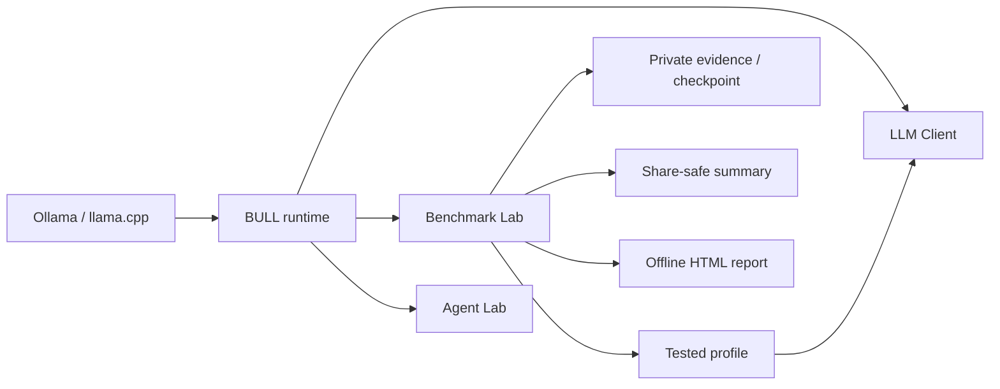

<p align="center">
  
</p>

<p align="center">
  <strong>Benchmarking &amp; Usage of Local LLMs</strong><br>
  Reproducible local-model evaluation on the hardware you actually use.
</p>

<p align="center">
  <a href="README.md"><strong>English</strong></a> ·
  <a href="README_RU.md"><strong>Русский</strong></a>
</p>

<p align="center">
  <a href="https://github.com/MrChronon/bull/releases/latest"></a>
  <a href="LICENSE"></a>
  <a href="https://github.com/MrChronon/bull/releases"></a>
  
</p>

<p align="center">
  <a href="https://github.com/MrChronon/bull/releases/latest/download/BULL-v0.28.0.7-Bundle.zip"><strong>Download BULL v0.28.0.7 for Windows</strong></a><br><br>
  <a href="#quick-start">Quick start</a> ·
  <a href="Docs/en/USER_GUIDE.md">User guide</a> ·
  <a href="Docs/ru/USER_GUIDE.md">Руководство</a> ·
  <a href="Docs/en/BENCHMARKS.md">Build a benchmark</a> ·
  <a href="https://github.com/MrChronon/bull/discussions">Discuss methodology</a> ·
  <a href="CONTRIBUTING.md">Contribute</a>
</p>

---

> **BULL is not a hosted leaderboard.** It is an open, portable benchmark lab for
> inspecting local LLM quality, stability, speed, recovery and runtime behavior
> without sending prompts or model output to a cloud service.

BULL — Benchmark Lab is a Windows-first client and reproducible evaluation
platform for local LLMs served by **Ollama** or a compatible **llama.cpp HTTP
server**. Run chat, compare selected models, resume interrupted suites, inspect
offline reports and move a tested profile into the working client.

<p align="center">
  
</p>

## Why BULL

| Evaluation problem | How BULL handles it |
| --- | --- |
| Client recovery can hide weak native output | Reports **native model quality** and **final system quality** separately |
| One average hides unstable seeds | Shows mean, sample SD, min/max, worst seed and rank stability |
| Model/test order can distort speed | Uses job-level counterbalanced scheduling for new runs |
| Cold load and warm generation get mixed | Classifies warm measurements from observed load duration |
| A disconnect can invalidate hours of work | Atomically checkpoints completed runs and resumes only unfinished work |
| Benchmark changes are hard to audit | Uses versioned, hash-checked, data-only benchmark packs |
| Private endpoints leak into shared results | Excludes connections, keys, logs, chats and runtime state from public releases |
| Generic tests miss a user's actual job | Loads prompt-only `.txt` or deterministic `.yaml` tasks from `UserTests` |
| A table does not answer “which model fits me?” | Shows transparent Quality, Speed, Balance and Low-memory choices plus custom weights |

## What you can measure

- **CHAT quality:** instruction following, groundedness, dialogue state,
  causality, semantic negation, Russian business language and reasoning;
- **RU Dialogue candidate:** 10 parameterized Russian cases with separately
  reported semantic and structural scores plus auditable critical failures;
- **contract completion:** generation, structure, terminal JSON and exact schema
  are tracked as distinct facts;
- **performance:** load duration, warm tokens/second, VRAM and GPU telemetry;
- **stability:** multi-seed dispersion, worst cases, uncertainty-aware Pareto
  status and category-level comparisons;
- **system behavior:** recovery use, retries, fingerprints, resume provenance and
  tested-profile export;
- **agent behavior:** a restricted Agent Lab MVP with independent verification;
- **hardware experiments:** an experimental Windows + Ollama GPU Lab.

After a run, BULL shows measured top-three places directly in the terminal for
Native quality, warm speed, observed VRAM and balance. These ranks remain
separate from quality/task-gated recommendations. The self-contained HTML report
adds numeric quality/speed and task/time charts, resource views, a test heatmap,
parameter provenance and plain-language test descriptions. Nothing becomes a new
benchmark score or universal ranking.

For your own work, copy a template into [`UserTests`](UserTests). A `.txt` file
runs the same prompt across selected models without fabricating quality. A
structured `.yaml` file can declare bounded deterministic checks. See the
[user-test authoring guide](Docs/en/BENCHMARKS.md).

The bundled `bull_chat_core@1.0.0` pack contains the stable 12-case CHAT Core.
The new `bull_ru_dialogue@1.0.0` candidate adds 10 public parameterized cases for
confirmed-state updates, evidence limits, causal caution, instruction retention,
business Russian and embedded-instruction resistance. Its scorer publishes
semantic and structural dimensions independently. Automatic scores support
investigation; they do not replace expert review or establish general model
superiority from a single run.

## Quick start

### Requirements

- Windows 11;
- Python 3 and PowerShell;
- Ollama or a compatible llama.cpp HTTP server;
- at least one model installed in the selected backend.

### Install

1. Download `BULL-v0.28.0.7-Bundle.zip` and its SHA-256 file from the
   [latest release](https://github.com/MrChronon/bull/releases/latest).
2. Verify the checksum, extract the archive and run
   `Install-BULL-v0.28.0.7.cmd`.
3. Choose `Client`, `Server` or `AllInOne`.
4. Start `BULL-v0.28.0.7.cmd` for chat or
   `BULL-Benchmark-Lab-v0.28.0.7.cmd` for evaluation.

The interface opens without a running backend, so connection setup, help,
diagnostics and saved reports remain available offline.

## Local, remote and all-in-one



- **Local:** client and models run on one Windows computer.
- **Remote:** BULL reaches a separately administered Windows node through a
  pinned SSH tunnel.
- **AllInOne:** install client and server roles on the same machine.

If `ssh bull-home` already works with your key, choose
**Connections → SSH alias** and enter `bull-home`. See the
[connection guide](Docs/en/CONNECTIONS.md). Never expose Ollama `11434` or
llama.cpp `8080` directly to the Internet.

## Reproducible outputs

Each benchmark can produce raw JSON/CSV, an immutable private evidence record, a
privacy-audited share-safe summary, an atomic checkpoint, tested profiles and a
self-contained HTML report. Provenance includes prompt/pack/scorer/verifier hashes
and separate launch/effective runtime fingerprints. Reports keep native model
output, client assistance and recovery behavior in distinct metric spaces.

```powershell
.\Run-Tests.ps1
.\Test-Public-Release.ps1 -AuditReleaseCandidatesOnly
.\Build-Release.ps1
```

The current release passes **400/400 offline regressions**, including clean
Python without site packages, forced `cp1251`, startup integration, manifest
hashes and ZIP verification.

## Help shape the benchmark

The project is looking for rigorous criticism from local-LLM users, benchmark
authors, inference engineers and hardware experimenters.

- Use [Discussions](https://github.com/MrChronon/bull/discussions) for benchmark
  design, scorer trade-offs, taxonomy, hardware methodology and open-ended ideas.
- Open a [benchmark feedback issue](https://github.com/MrChronon/bull/issues/new/choose)
  for a concrete false positive, false negative or reproducibility problem.
- Open a bug report only when behavior is reproducible; sanitize endpoints,
  usernames, paths, prompts and model responses before attaching evidence.
- Read [CONTRIBUTING.md](CONTRIBUTING.md) before changing prompts, scorers,
  schemas, runtime or benchmark packs.

English and Russian are both welcome. Small, test-backed pull requests are
preferred. The current architecture and transition plan live in
[Docs/BULL_TARGET_ARCHITECTURE.md](Docs/BULL_TARGET_ARCHITECTURE.md) and
[Docs/BULL_TRANSITION_ROADMAP.md](Docs/BULL_TRANSITION_ROADMAP.md).

## Security and privacy

Language models are not bundled. Generated-code execution is not an OS sandbox;
use a disposable VM without secrets or network access for untrusted output.
Public release gates exclude `Chats`, `Runtime`, `Benchmarks`, `Exports`,
`Workspace`, keys, endpoints and local logs. Read the
[security model](Docs/en/SECURITY.md) before exposing any server role.

## Project status

`v0.28.0.7` is the **Ollama Profile Comparison Fix** release. It keeps the primary UI simple and
compare, chat, connection and more; adds clean sampling-source navigation, live
CPU/RAM context and per-run checkpoints. Existing expert features remain under
advanced/experimental menus. Built-in prompts, scorers, recovery and runtime
inference behavior remain unchanged. See the
[release notes](Docs/en/RELEASE_NOTES.md) and
[documentation index](Docs/README.md).

## License and naming

BULL is released under the [MIT License](LICENSE). Third-party models, engines
and benchmark packs retain their own licenses. Use **BULL — Benchmark Lab** on
first mention; the technical namespace is `bull_llm`.

The download badge counts the combined downloads of release assets across all
published BULL releases. It is GitHub's public aggregate, so it can include the
ZIP, checksum and other attached release files.
