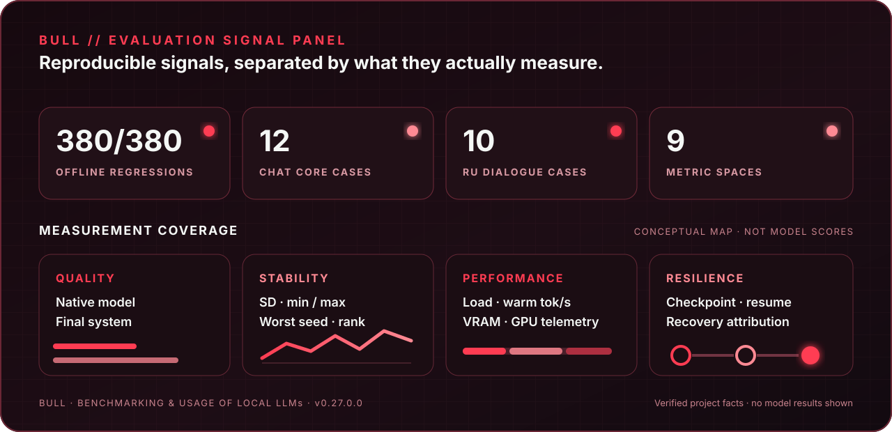

<p align="center">
  
</p>

<p align="center">
  <strong>Benchmarking &amp; Usage of Local LLMs</strong><br>
  Воспроизводимое сравнение локальных моделей на вашем оборудовании.
</p>

<p align="center">
  <a href="README.md"><strong>English</strong></a> ·
  <a href="README_RU.md"><strong>Русский</strong></a>
</p>

<p align="center">
  <a href="https://github.com/MrChronon/bull/releases/latest"></a>
  <a href="LICENSE"></a>
  <a href="https://github.com/MrChronon/bull/releases"></a>
</p>

<p align="center">
  <a href="https://github.com/MrChronon/bull/releases/latest/download/BULL-v0.27.0.1-Bundle.zip"><strong>Скачать BULL v0.27 для Windows</strong></a><br><br>
  <a href="Docs/ru/USER_GUIDE.md">Руководство</a> ·
  <a href="Docs/ru/BENCHMARKS.md">Бенчмарки</a> ·
  <a href="Docs/ru/CONNECTIONS.md">Подключения</a> ·
  <a href="https://github.com/MrChronon/bull/discussions">Обсуждения</a> ·
  <a href="CONTRIBUTING.md">Участие</a>
</p>

---

> **BULL — не облачный leaderboard.** Это открытая переносимая лаборатория для
> проверки качества, устойчивости, скорости и runtime-поведения локальных LLM без
> отправки prompts и ответов в сторонний сервис.

BULL работает с Ollama и совместимым HTTP-сервером llama.cpp. Он позволяет
общаться с моделями, сравнивать выбранные модели, восстанавливать прерванные
прогоны, анализировать результаты в терминале и автономном HTML и переносить
проверенный профиль в рабочий клиент.

<p align="center">
  
</p>

## Зачем нужен BULL

| Проблема | Решение BULL |
| --- | --- |
| Recovery может скрыть слабый первый ответ | Native и Final system quality показываются отдельно |
| Среднее скрывает нестабильные seed | SD, min/max, worst seed и rank stability |
| Порядок влияет на скорость | Job-level counterbalanced план |
| Cold load смешивается с warm generation | Warm определяется по наблюдаемому load duration |
| Обрыв уничтожает долгий прогон | Atomic checkpoint и resume только незавершённой работы |
| Общие тесты не отражают работу пользователя | Собственные `.txt` и строгие `.yaml` задачи |
| Таблица не отвечает «что выбрать» | Качество, Скорость, Баланс, Мало памяти и свои веса |

После прогона краткое сравнение отображается прямо в BULL. Терминал и HTML
показывают относительную карту Native quality/скорости. Эти рекомендации относятся
только к моделям и условиям данного отчёта и не являются универсальным рейтингом.

## Быстрый старт

1. Скачайте ZIP и SHA-256 из [последнего релиза](https://github.com/MrChronon/bull/releases/latest).
2. Проверьте checksum и распакуйте архив в новую папку.
3. Запустите `Install-BULL-v0.27.0.1.cmd`.
4. Выберите Client, Server или AllInOne.
5. Запустите `BULL-v0.27.0.1.cmd`.
6. Выберите язык, затем **Подключение** и **Сравнить модели**.

Приложение открывает меню без работающей Ollama: настройки, справка и сохранённые
отчёты доступны offline. Для чата и нового benchmark нужна выбранная работающая связь.

## Локально и удалённо

- **Локально:** BULL и модели работают на одном Windows-компьютере.
- **Удалённо:** BULL использует pinned SSH tunnel к отдельно настроенному узлу.
- **AllInOne:** installer готовит клиентскую и серверную роли на одной машине.

Если `ssh bull-home` уже работает по ключу, выберите **Подключение → Новый сервер
по SSH-алиасу** и введите `bull-home`. Не открывайте Ollama `11434` или llama.cpp
`8080` напрямую в Интернет. Подробности: [подключения](Docs/ru/CONNECTIONS.md).

## Результаты

Benchmark может создать raw JSON/CSV, checkpoint, summary, tested profiles,
private/share-safe evidence и автономный HTML. Provenance содержит hashes prompt,
pack, scorer и verifier, а также раздельные launch/effective fingerprints.

```powershell
.\Run-Tests.ps1
.\Test-Public-Release.ps1 -AuditReleaseCandidatesOnly
.\Build-Release.ps1
```

## Безопасность

Модели не входят в bundle. Выполнение сгенерированного кода не является
OS-песочницей. Публичный релиз исключает `Chats`, `Runtime`, `Benchmarks`,
`Exports`, `Workspace`, ключи, endpoints и логи. Перед публикацией результатов
прочитайте [модель безопасности](Docs/ru/SECURITY.md).

## Обратная связь

[Discussions](https://github.com/MrChronon/bull/discussions) предназначены для
идей по методике и развитию benchmark. Для воспроизводимого дефекта создайте Issue,
предварительно удалив endpoints, usernames, пути, prompts и ответы моделей.

BULL распространяется по [лицензии MIT](LICENSE).
